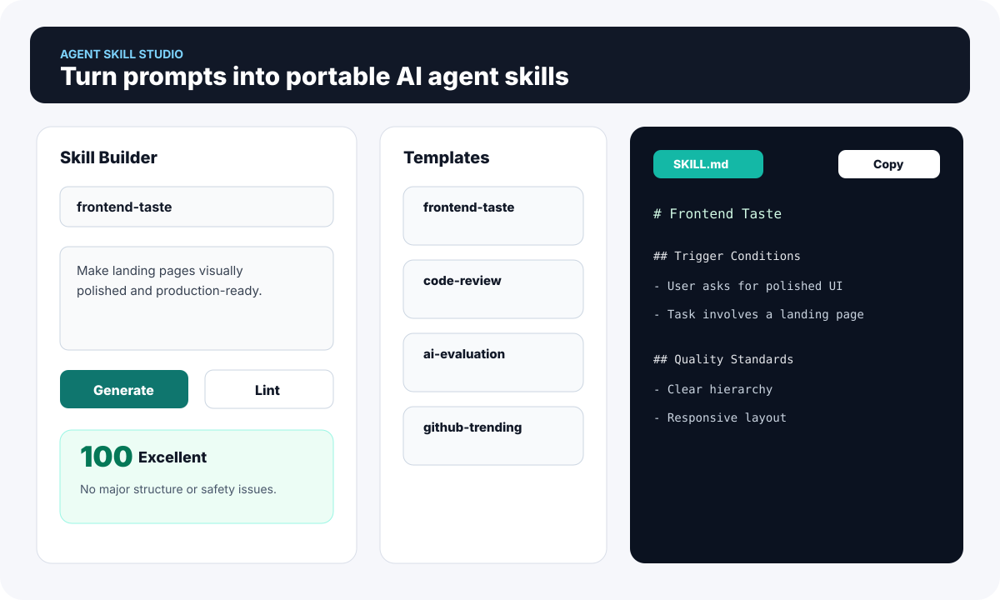
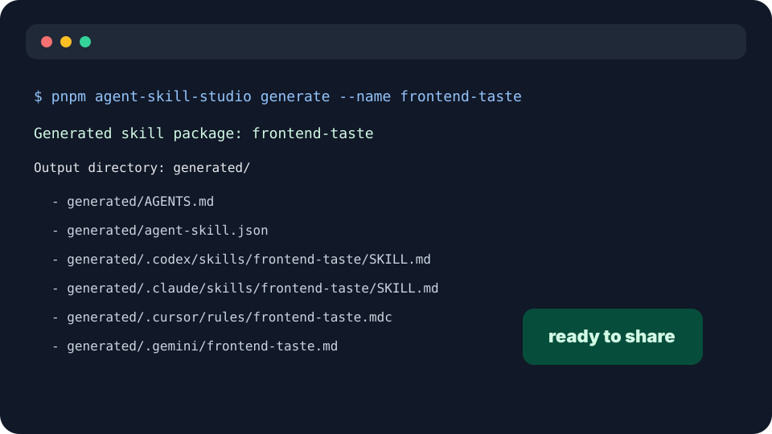
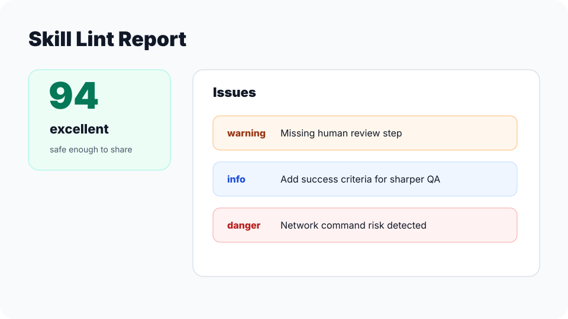

# Agent Skill Studio

[](https://www.npmjs.com/package/agent-skill-studio)
[](./LICENSE)
[](./.github/workflows/ci.yml)
[](https://github.com/yeb07011/agent-skill-studio)
[](https://www.typescriptlang.org/)

**Turn prompts, SOPs, and workflow notes into reusable AI agent skills for Claude Code, Codex, Cursor, and Gemini CLI.**

Agent Skill Studio gives AI coding tools a portable skill package format: **generate** tool-specific instructions, **lint** them for safety and completeness, and **export** a manifest that can be shared in a repo or future registry.



## Why Star It

- **One prompt, four targets:** Codex, Claude Code, Cursor, and Gemini CLI.
- **Generate / lint / export:** Markdown skill files plus `agent-skill.json`.
- **Safe skill linting:** catches vague goals, missing review steps, dangerous commands, network risk, deletion risk, and secret leakage.
- **Local-first MVP:** no LLM API key required; deterministic templates today, provider interface ready for later.
- **CLI + Web UI:** scriptable for maintainers, friendly for non-experts.

## Quick Start

```bash
pnpm install
pnpm test
pnpm build
```

```bash
pnpm agent-skill-studio generate --name frontend-taste --description "Make landing pages visually polished"
pnpm agent-skill-studio lint ./generated/.claude/skills/frontend-taste/SKILL.md
pnpm dev
```

## Example Output

```text
generated/
  AGENTS.md
  agent-skill.json
  .codex/skills/frontend-taste/SKILL.md
  .claude/skills/frontend-taste/SKILL.md
  .cursor/rules/frontend-taste.mdc
  .gemini/frontend-taste.md
  examples/prompt.md
  README.md
```

## CLI

```bash
pnpm agent-skill-studio templates
pnpm agent-skill-studio generate --template code-review
pnpm agent-skill-studio generate --name frontend-taste --description "Make landing pages visually polished"
pnpm agent-skill-studio lint ./generated/.claude/skills/frontend-taste/SKILL.md
```

Generated packages include target files for Claude Code, Codex, Cursor, Gemini CLI, a generic `AGENTS.md`, example prompt, README, and export manifest.

## Web UI

```bash
pnpm dev
```

The Web UI runs locally in the browser. It includes skill name and description inputs, template cards, Generate and Lint actions, lint score card, generated file preview, and copy button.

## Safe Skill Linting

The linter returns:

```json
{
  "score": 100,
  "level": "excellent",
  "issues": [
    {
      "severity": "info",
      "message": "No major structure or safety issues found.",
      "suggestion": "Review the skill against your actual workflow before sharing it."
    }
  ]
}
```

It checks for missing structure, missing success criteria, missing human review, vague objectives, unsafe autonomous execution, network command risk, file deletion risk, dangerous commands, and secret exfiltration risks such as `.env`, `GITHUB_TOKEN`, `OPENAI_API_KEY`, and private keys.

## Built-In Templates

| Template | Purpose |
| --- | --- |
| `frontend-taste` | Help AI agents generate more polished frontend pages. |
| `code-review` | Review code for bugs, regressions, security risks, and missing tests. |
| `product-manager-interview` | Prepare for AI product manager interviews. |
| `ai-evaluation` | Design LLM evaluation tasks, rubrics, and reports. |
| `github-trending-research` | Research GitHub trending projects and produce reports. |
| `xiaohongshu-content-agent` | Plan, generate, and review Xiaohongshu content. |

See [examples/gallery.md](./examples/gallery.md) for the full gallery.

## Screenshots

| Web UI | CLI | Lint report |
| --- | --- | --- |
|  |  |  |

## Docs

- [Skill format](./docs/skill-format.md)
- [Safety](./docs/safety.md)
- [Examples](./docs/examples.md)
- [Roadmap](./docs/roadmap.md)

## Project Structure

```text
apps/web              Vite + React local UI
packages/core         Shared generator, linter, templates, formatters
packages/cli          Node.js CLI entrypoint
examples              Source prompts, SOPs, and template gallery
generated             Default output directory
```

## Contributing

Contributions are welcome. Good first areas: add templates, improve formatters, add lint rules, polish the Web UI, or contribute real agent workflow examples.

Before opening a PR:

```bash
pnpm lint
pnpm typecheck
pnpm test
pnpm build
```

## Safety Notes

Generated skills should be reviewed before use. Do not put secrets, credentials, API keys, private keys, private repository data, private user data, or environment files into a skill.

Agent Skill Studio is a generator and linter, not a sandbox. The user and the target AI coding tool are still responsible for reviewing and approving actions.
